# Leonardo N. Ferreira, Ph.D.

I am currently a Postdoctoral Researcher at the **University of Campinas (Unicamp)** and hold a Ph.D. from the **University of São Paulo**.

I'm a researcher and data scientist focused on developing computational methods to extract insights from large-scale and complex datasets. My work bridges foundational computer science with its application in climate science, health informatics, and computational social science.

## Positions

* :brazil: [University of Campinas (Unicamp)](https://unicamp.br/)\
    Postdoctoral Researcher, 10/2025 - present
* :brazil: [Samsung Research Brazil](https://research.samsung.com/srbr)\
    Senior Research Scientist / Senior AI Specialist, 12/2023 - 09/2025
* :uk: [Big Data Institute](https://www.bdi.ox.ac.uk/) / [University of Oxford](https://www.ox.ac.uk/)\
    Senior Postdoctoral Researcher, 10/2022 - 10/2023
* :de: [Center for Humans & Machines](https://www.mpib-berlin.mpg.de/chm) / [Max Planck Institute for Human Development](https://www.mpib-berlin.mpg.de/en)\
   Postdoctoral Researcher, 06/2020 - 09/2022
* :de: [Potsdam Institute for Climate Impact Research](https://www.pik-potsdam.de/en)\
   Visiting Researcher, 04/2019 - 03/2020
* :brazil: [Brazil's National Institute for Space Research (INPE)](https://www.gov.br/inpe/pt-br)\
   Postdoctoral Researcher, 10/2017 - 05/2020
* :us: [Northwestern University](https://www.northwestern.edu/)\
   Visiting Predoctoral Researcher, 11/2015 - 07/2016
* :brazil: [Universo Online (UOL)](https://www.uol.com.br/)\
   Software Developer, 05/2012 - 10/2013

## My GitHub Stats

## Contact

📫 <a href="mailto:lnf@ic.unicamp.br">lnf@ic.unicamp.br</a>  

